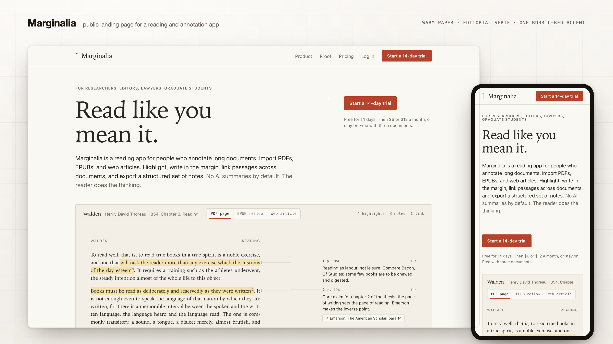
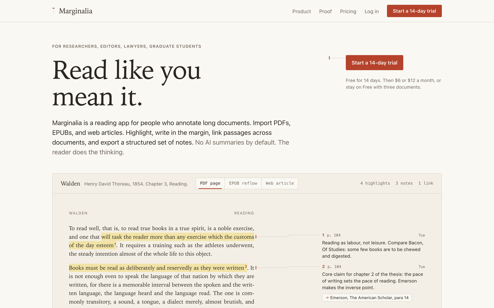
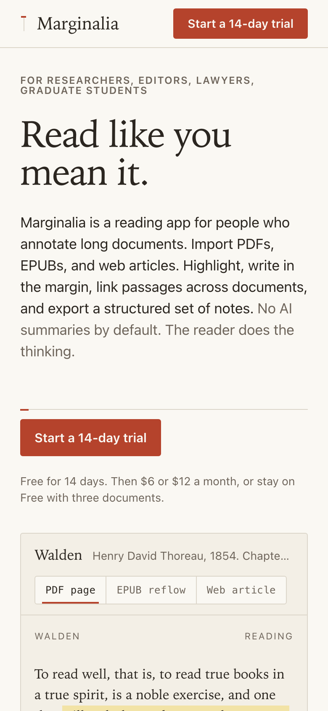
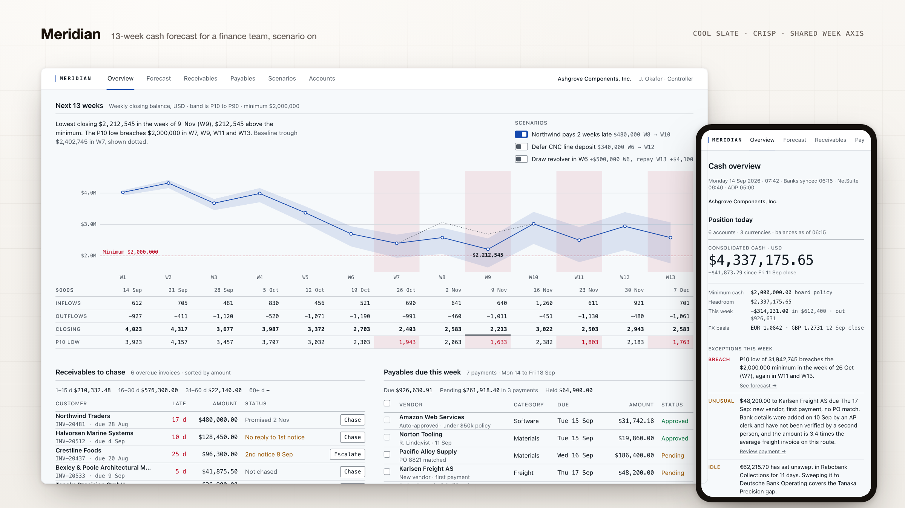
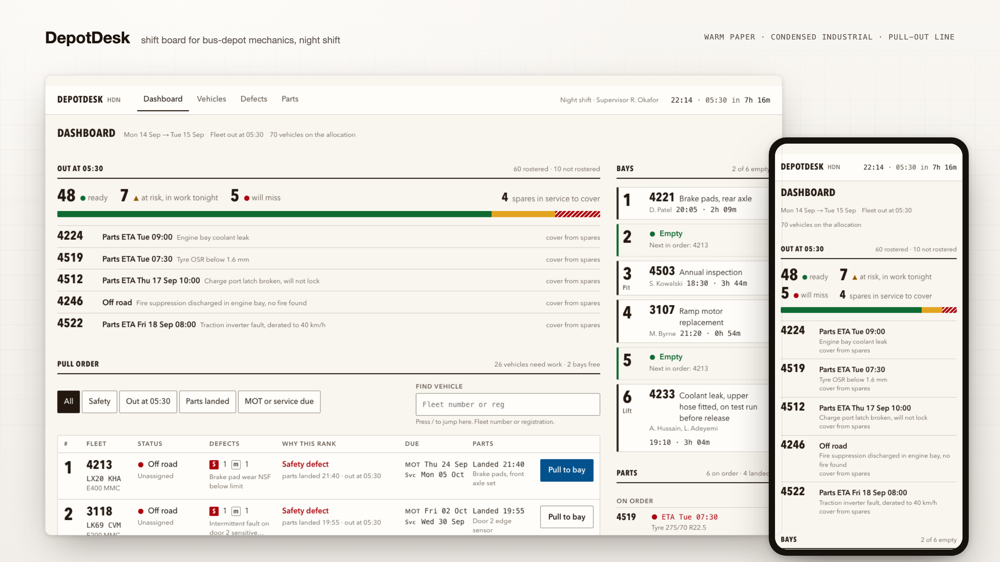
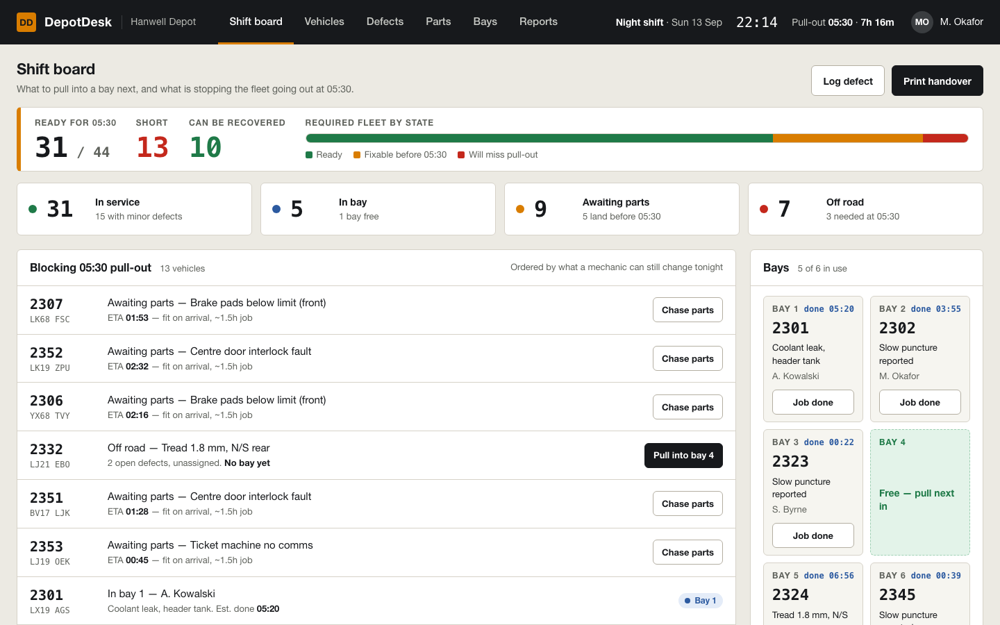
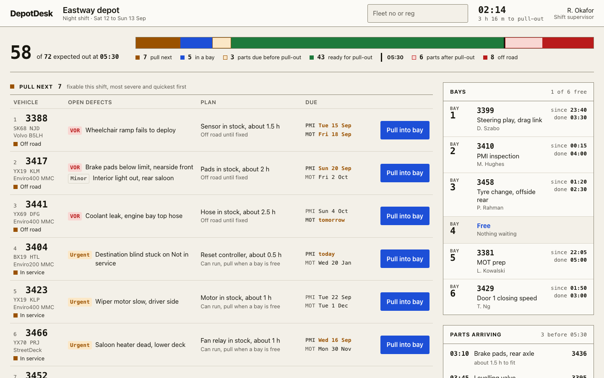
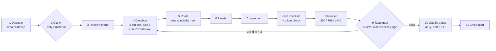

<h1 align="center">Creative Frontend Director</h1>

<p align="center">
A skill that makes your coding agent design the product that exists, not the template it remembers.
</p>

<p align="center">
<a href="LICENSE"></a>


</p>

<p align="center">

</p>

<p align="center"><sub>Every image on this page is a real render of code the skill produced from a one-paragraph brief and the prompt shown. No mockups, no retouching. Briefs, DESIGN.md files, and rubric reviews are linked under each one.</sub></p>

## Showcase

Three products, three briefs, one prompt each. The skill derived a different identity for each from the brief alone: no brand assets were provided.

### Marginalia · "create the landing page"

A reading app for people who annotate long documents. The director chose an editorial direction it named *Running Margin*: the product's own reading view, with real Thoreau and real margin notes, is the hero image. Warm paper, a serif display face, rubric red as the only accent, and a note-anchor glyph as the wordmark. Public route, so SEO and Open Graph were part of the run.

| Desktop | Phone |
|---|---|
|  |  |

[brief](docs/showcase/marginalia-brief.md) · [directions considered](docs/showcase/marginalia-directions.md) · [DESIGN.md](docs/showcase/marginalia-DESIGN.md) · [review](docs/showcase/marginalia-review.md)

### Meridian · "build the main cash overview screen"

Cash-flow intelligence for a finance team. Cool slate, mono numerals, no decoration, and one signature: the 13-week forecast band and the week table share the same thirteen columns, so a scenario toggle recomputes both and a breach of the cash minimum tints chart and grid together.

<p align="center"></p>

[brief](docs/showcase/meridian-brief.md) · [directions considered](docs/showcase/meridian-directions.md) · [DESIGN.md](docs/showcase/meridian-DESIGN.md) · [review](docs/showcase/meridian-review.md)

### DepotDesk · "build the main dashboard"

A maintenance tool for bus-depot mechanics on a night shift. Condensed industrial type, warm workshop paper, a readiness bar with a hatched "will miss" segment, and a pull order ranked against the 05:30 departure. This is the run a blind judge scored 24/30 and sent back for a refine round; the section below shows why.

<p align="center"></p>

[DESIGN.md](docs/evals/s12-DESIGN.md) · [directions considered](docs/evals/s12-directions.md) · [review](docs/evals/s12-review.md)

## Evidence: same prompt, same repo, with and without the skill

Two fresh agents were given the DepotDesk fixture and the prompt **"Build the main dashboard."** One had this skill. One did not.

| Without the skill | With the skill, v4.0 |
|---|---|
|  |  |
| Four stat counters, every region in a rounded card, pill badges, a chart added "by system", main-plus-rail layout. Competent. Could be any ops dashboard. | The fleet ranked against the 05:30 pull-out, a line drawn through the list separating what goes out from what does not, bays as a physical board, no chart, no cards around content. |
| No written brief. No direction. No review. | `.design/brief.md`, three scored directions, a ten-section `DESIGN.md`, a two-round rubric review, seven screenshots. |

Artifacts from the skilled run: [directions](docs/evals/s1-directions.md), [DESIGN.md](docs/evals/s1-DESIGN.md), [review](docs/evals/s1-review.md). Full log in [evals/baseline.md](evals/baseline.md).

### Then the 4.2 rules: commit to an identity, finish the component, get judged

The same fixture under the identity commitment, the craft checklist, and a blind judge produced the DepotDesk render in the showcase. The implementer scored itself 25/30. A judge that saw only the screenshots, the brief, and the rubric scored it 24/30 with Finish at 3, and named the tablet defects the implementer missed: a column colliding with the action button at 768 and a silently dropped parts column. Verdict: refine, not pass. That disagreement is the point of the judge.

## Why

Coding agents ship generic UI because they assemble from defaults: sidebar plus card grid, four KPI tiles, purple accent, glass, bento. Prompting "make it less generic" polishes the same structure. This skill changes the order of work. The agent reads the product first, writes a direction down, implements it, renders it, and scores the render against a rubric before it is allowed to say "done".

## Quick Start

```bash
git clone https://github.com/naufalrandi/creative-frontend-director.git
cd creative-frontend-director
./setup.sh                 # installs to ~/.agents/skills, read by most hosts
./setup.sh --all           # installs for every agent host found on this machine
```

Then, in any supported agent:

```
build the dashboard
redesign the settings page
make this page less AI-generated
extract a design system from our current app
```

No need to say "design". The description triggers on ordinary frontend requests.

## How It Works



Five rules hold the whole thing together:

1. **Written, not thought.** The brief, the three directions, `DESIGN.md`, and the review are files. A step that only happened in reasoning did not happen.
2. **Ask once, only if it matters.** At most four questions, recommended answer first, and only when the answer would change direction, structure, or scope. Every guess is reported at the end with the rule that chose it.
3. **One specialist per surface.** Other taste skills execute the direction in `DESIGN.md`. They do not redefine it.
4. **No render, no done.** Screenshots at three widths are the input to the gate, not a nice-to-have.
5. **Rethink before polish.** A rubric score under 3 on product fit, hierarchy, typography, rhythm, or identity sends the agent back to structure. Shadows and radii are not allowed to fix a weak concept.
6. **Commit and finish.** `DESIGN.md` must state six identity commitments (wordmark, type pairing, palette temperature, accent budget, shape, motion), and the sixth rubric dimension, Finish, is capped at 2 while any craft-checklist P0 is open: states, empty and loading, real content, token conformance.

## What You Get In Your Repo

```
DESIGN.md                 the locked direction: theme, tokens, type, spacing, components, motion, voice, anti-patterns, signature
.design/
  brief.md                what the product is, tagged observed / provided / inferred
  directions.md           three structurally different directions, scored, one picked
  brand-spec.md           tokens extracted from your real brand source, when you have one
  review.md               the rubric score, rounds, and remaining weaknesses
  screens/                phone, tablet, desktop renders
```

The next session, and every other agent, reads the same `DESIGN.md`. Direction survives context resets.

## Anti-Slop, As Recipes

Prohibitions get negotiated away. So each default reflex is paired with what to build instead. Three of the fifteen:

| Default reflex | Build this instead |
|---|---|
| a row of four KPI cards | one primary number with its trend and context, the rest inline or in a compact table with tabular numerals |
| sidebar plus card grid | start from the questions the user asks on arrival; answer each in its tightest form; pick navigation from module count and switching frequency |
| chart to look sophisticated | a chart only when a decision depends on shape over time or comparison, otherwise a number with a delta |

Full table in [core/anti-slop.md](core/anti-slop.md), plus the two tests every screen must pass: the removal test and the brand-removal test.

## Works With Your Other Skills

The director sits above specialist taste skills, not beside them. A registry in [core/specialist-router.md](core/specialist-router.md) maps the chosen direction to at most one specialist, verifies it exists on the host, and hands it `DESIGN.md`. Engineering, accessibility, browser QA, and data-viz skills are called as needed in the later stages.

On Claude Code, a small `UserPromptSubmit` hook makes the director the first design authority before any sibling skill loads:

```bash
./setup.sh --with-hook
```

Other hosts use an instructions-file snippet or a rule file. See [hooks/README.md](hooks/README.md).

## Supported Hosts

Stage files name actions, not host tools. [reference/harness-adapters.md](reference/harness-adapters.md) maps each action per host with a fallback, so the same skill runs everywhere `SKILL.md` is read.

| Host | Install | Invoke |
|---|---|---|
| Claude Code | default | Skill tool, auto, hook routing |
| Codex CLI and IDE | default | `$creative-frontend-director` or auto |
| OpenCode | default or `--agent opencode` | `skill` tool or auto |
| Antigravity CLI `agy` | `--agent agy` | `/creative-frontend-director` or auto |
| Gemini CLI | default or `--agent gemini` | `activate_skill` or auto |
| Cursor | `--agent cursor` | auto, plus the rule in `hooks/cursor/` |
| GitHub Copilot CLI | default or `--agent copilot` | `/skills` or auto |
| Hermes Agent | `--agent hermes` | `skill_view("creative-frontend-director")` |
| Any project | `--agent project` | writes `.agents/skills/` into the repo |

`--link` symlinks one checkout into every host. `--list` shows what is detected. Per-host agent definitions for isolated runs are in [agents/](agents/).

## Layout

```
SKILL.md          entry point: authority stack, router, eleven stages, hard rules
core/             stages 1 to 6, the anti-slop recipe, the specialist router, the asset ladder
reference/        design reference, identity kits, motion and implementation recipes, harness adapters
gates/            taste rubric, craft checklist, judge prompt, secondary quality gates
workflows/        which stages each workflow runs, and how to render
templates/        DESIGN.md, design read, brand spec, design contract
hooks/            first-layer routing per host
agents/           isolated director in each host's agent format
evals/            runnable scenarios and the baseline log
docs/showcase/    showcase renders, briefs, DESIGN.md files, and reviews
docs/hero/        composed hero images, regenerated with docs/tools/compose-hero.sh
docs/evals/       the before/after eval screenshots and artifacts
```

## Honest Limits

- The rubric is scored by an independent judge subagent when the host can dispatch one; otherwise it is a self-score and says so.
- Eval S1 has been run. S2 to S11 are written and waiting.
- Antigravity has no verified prompt hook, so routing there is by description or explicit `/creative-frontend-director`.
- Raster image generation needs a configured provider skill. Without one the agent authors SVG or leaves an honest placeholder.

## Contributing

Skill edits are tested like code: run a scenario from [evals/scenarios.md](evals/scenarios.md) without and with your change, record both in `evals/baseline.md`, open a PR. Details in [CONTRIBUTING.md](CONTRIBUTING.md). Agent-assisted contributors should read [CLAUDE.md](CLAUDE.md).

## License

[MIT](LICENSE)
